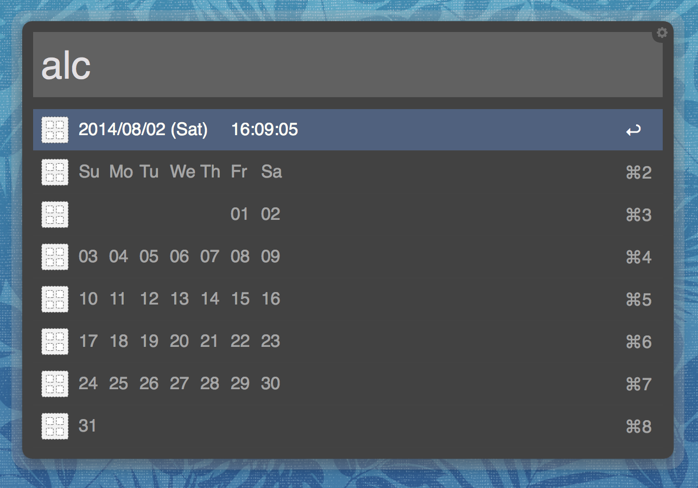

How to use
==========

About '*alc*'?
--------------
'*alc*' is an Alfred workflows plugin to display a calendar.
Through the use of this plugin, be able to check calendar
and current time, quickly.

Install
-------
Installation is very simple :)

1. Download zip file and unzip it.

  * https://github.com/sbkro/alc/archive/master.zip

2. Double click the *alc.alfredworkflow*.
3. Click *'Import'* button.

How to use
----------

Display current month.
^^^^^^^^^^^^^^^^^^^^^^
In displaying calendar and datetime currently, please type
'*alc*' in Alfred prompt.::

    alc

Display specified month.
^^^^^^^^^^^^^^^^^^^^^^^^
In dispaying calender of specified month, please type
'*alc*' and month in Alfred prompt.::

    alc <month [1-12]>

Display specified month and year.
^^^^^^^^^^^^^^^^^^^^^^^^^^^^^^^^^
In dispaying calender of specified month and year, please type
'*alc*', month and year in Alfred prompt.::

    alc <month [1-12]> <year [1900-9999]>

Configurations
--------------
'*alc*' is able to change some configurations.

1. Open Alfred preference.
2. Select '*Workflows*' tab from toolbar.
3. Select '*Aflred Calnder* from list.'
4. Duble click 'alc' icon.
5. Open dialog and check '*Script:*'.
6. Variable is as follow.

    +----------------------------+----------------------------------------------+
    | name                       | description                                  |
    +============================+==============================================+
    | query                      | Don't edit.                                  |
    +----------------------------+----------------------------------------------+
    | first_week_day             | First day of week. You can use follow values.|
    |                            |                                              |
    |                            | * calendar.MONDAY                            |
    |                            | * calendar.TUESDAY                           |
    |                            | * calendar.WEDNESDAY                         |
    |                            | * calendar.THURSDAY                          |
    |                            | * calendar.FRIDAY                            |
    |                            | * calendar.SATURDAY                          |
    |                            | * calendar.SUNDAY                            |
    +----------------------------+----------------------------------------------+
    | default_datetime_format    | It is the format which to display the        |
    |                            | current datetime.                            |
    +----------------------------+----------------------------------------------+
    | specified_datetime_format  | It is the format which to display the        |
    |                            | specified datetime.                          |
    +----------------------------+----------------------------------------------+

Licence
-------
* New BSD License

Requirements
------------
* OSX 10.9+
* Python 2.7.5 (Default version of OSX 10.9)
* Alfred v2.0+ with Powerpack.
    .. seealso::
        http://www.alfredapp.com
